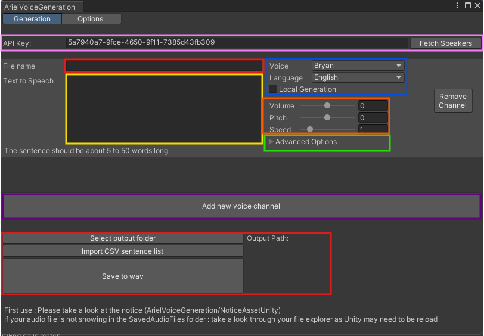
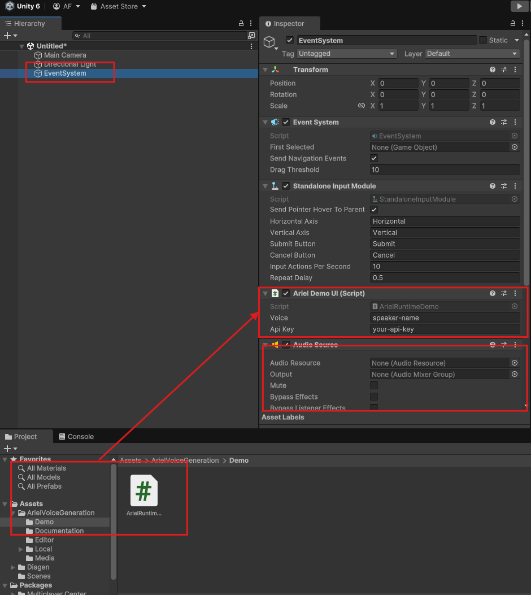
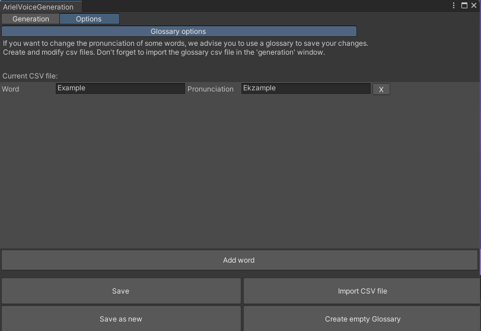

# Quickstart

**[← Table of contents](../README.md#table-of-contents)**

> [!IMPORTANT]
> Please ensure that the Ariel plugin is installed and enabled within your project. Please read [this section](../Documentation/Setup.md#installation) for more details on how to install the Ariel plugin.

### On this page

[🎬 Editor Pre-generation](#-editor-pre-generation) 
[🎤 Runtime generation](#-runtime-generation) 
[📚 Glossary](#-glossary) 

## 🎬 Editor Pre-generation

The editor interface allows you to generate audio sentences and download them as a file. The audio files can then be imported to your Project.

1. On the Editor main window, go to **Window** > **ArielVoiceGeneration**:  

2. The Ariel Editor Window should open. Enter the sentence and adjust parameters according to your needs:  

*  On the  <b style="color: #ff66b2">Pink box</b>, enter the API Key provided to you. The API Key is required to generate the audio file. If you do not have an API Key, please contact us at *contact@xandimmersion.com*. If no speakers are available, you need to press on *Fetch Speakers* to get all local and remote speakers.

*   On the  <b style="color: #ffff33">Yellow box</b>, enter the sentence that will be generated by the API. The sentence supports [tags](../Documentation/Features.md#-tags), like `<pause 1s>`.

*   On the  <b style="color: #3398ff">Blue box</b>, select the speaker and the language that will be used to generate the sentence. You can use the fields *Language* Dropdown to see which languages exist for the currently selected speaker. By checking the *Local Generation* Checkbox you are switching between the local and the remote TTS generation. The speakers are displayed accordingly. See [speakers list](../README.md#speakers).

*   On the  <b style="color: #ffb266">Orange box</b>, adjust the pitch (in semitones), the audio speed and the volume (in dB) that will be applied to the audio file before saving it. You can also use your favorite game audio software tool to change those settings more dynamically **after** the file was saved.

*   On the  <b style="color: #66ff66">Green box</b>, you can add [audio effects](../Documentation/Features.md#-audio-effects) that will be applied to the audio file. Those audio effects are optional. You can also select Stereo Audio, High Sample Rate (44kHz) and a voice Improvement algorithm which will enhance the generated audio. You can also select if you want to use a previously generated Glossary.

*   On the  <b style="color: #b266ff">Purple box</b>, you can add new voice channels to add another voice generation setting. You can add and remove as many channels as you want. All the channels will be generated.

*   On the  <b style="color: #ff6666">Red box</b>, Select the audio file destination and filename. We recommend to always use the *WAV* format, as MP3 is not natively supported with Unreal Engine yet.

## 🎤 Runtime generation

### Info

To create a game that supports Text-To-Speech inside a game, you will need to use the API provided by the plugin. The API is available to anyone that has a subscription with us. Read the [API Reference](../Documentation/API.md) thoroughly to understand how to use the API.

It is recommended to use the API in a C# script to generate the audio file. 

Our [Editor](#-editor-pre-generation) can help you to generate the audio file and test the different settings before using the API in your game. It used the same API as the plugin.

> Be sure to not use the Editor Functions in a packaged game. The Editor functions are only available in the Editor.

### Runtime Demo

To learn how to use the basic functionality of our tool, we created an easy to use Demo Script that you can use to generate audio files. It is located in the `ArielVoiceGeneration/Demo` folder. The script is named `ArielRuntimeDemo.cs`. Please ensure to review the script for detailed instructions on how to implement the audio generation process.

The following will describe a step by step guide on how to use the Demo Script:

1. Create a new Unity project

> We recommend using Unity Version 2021.3.38f1 for compatibility with the Ariel plugin. Other versions may work, but we have not tested all of them.
    
2. Add the `ArielVoiceGeneration` Plugin to your project following the installation instructions in [Setup](../Documentation/Setup.md/#installation). Make sure the Network Compatibility is set as described.

3. Create a new empty scene (or use an existing one) in your project using `File` > `New Scene`.

4. Add an Event System to your Scene by right-clicking in the Hierarchy and selecting `UI` > `Event System`.

5. Add an Audio Component to your Event System by selecting the Event System in the Hierarchy and clicking `Add Component` in the Inspector. Search for `Audio Source` and add it.

6. Add the `ArielRuntimeDemo.cs` script to your project. You can find it in the `ArielVoiceGeneration/Demo` folder. Drag it onto your Event System in the Inspector to add it.

7. Add the speaker name and your Api Key into the public boxes (as shown in the screenshot below).

> For checking the available speakers, you can use the `Fetch Speakers` button in the Ariel Editor or on our [Create APP](https://create.xandimmersion.com/).

8. Now run your game. A grey text box will show up. Enter the text you want to generate and press the `Enter` key. The audio file will be generated and played back.

> Check out the Script to see how you can use the API in your game. Further functionality can be added to the script to enhance the user experience. This information can be found in the [API Reference](../Documentation/API.md).

## 📚 Glossary

The glossary is a list of words that are pronounced differently than they are written. The glossary is used to improve the pronunciation of the generated audio. The glossary is a JSON file that can be generated by the plugin. The glossary is optional and can be used in the editor interface.

Using the Glossary you can Add or Remove words that are not pronounced correctly by the TTS engine. The Glossary is a JSON file that can be generated by the plugin. 

You can save your glossary to a local file and load it in the editor interface.

