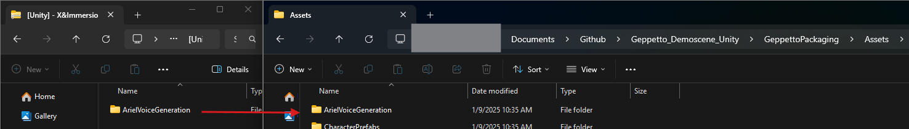
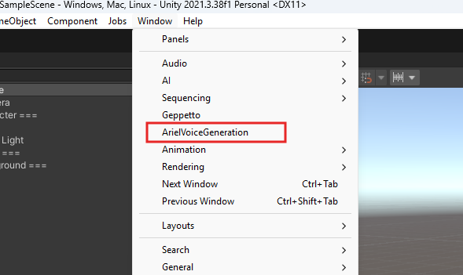
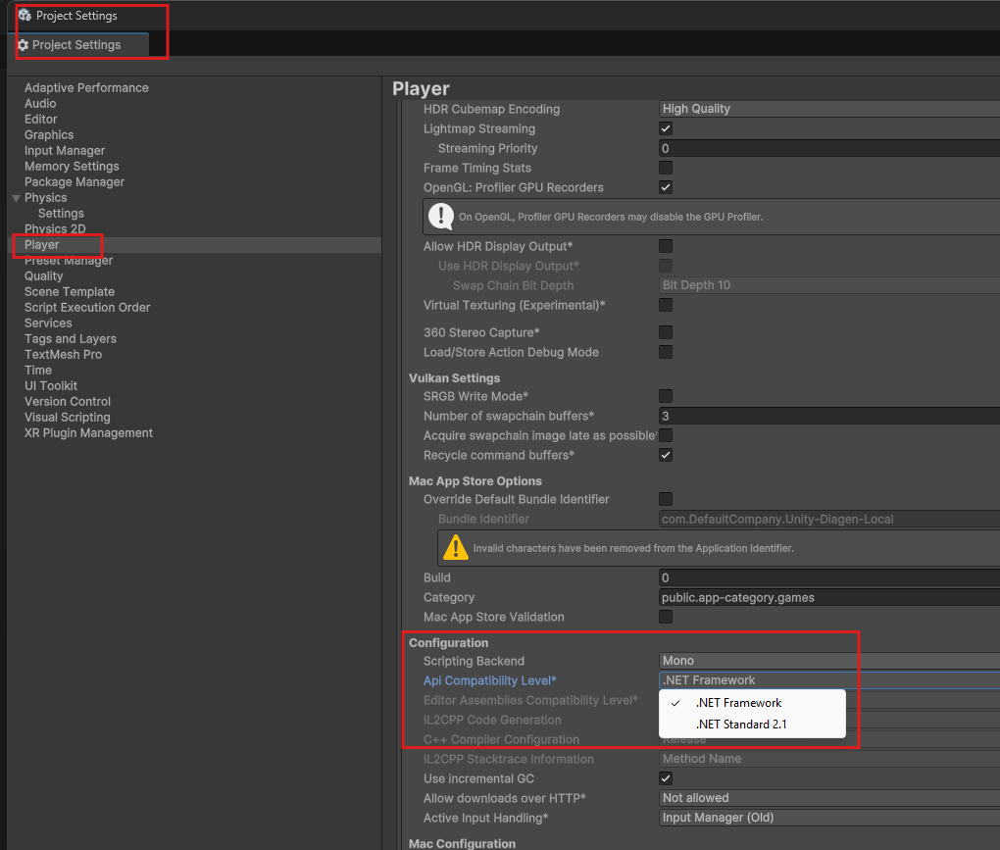

# Setup

**[← Table of contents](../README.md#table-of-contents)**

> The Ariel plugin is compatible was developed in **Unity Version 2021.3.38f1**. It is recommended to use this version to avoid compatibility issues.

## Installation

### From a ZIP archive (source code)

0. If not already done, create a new project with the Engine version of your choice and navigate to the project's root directory.

1. Extract the content from the ZIP archive to the root directory of your Unreal project: 

2. Reopen your project.

3. Navigate to **Window** and make sure ArielVoiceGeneration is listed in the dropdown menu. 

4. The API used requires the .Net 4.0 API compatibility level. To set this up, navigate to **Edit** > **Project Settings** > **Player** > **Other Settings** and set the **Api Compatibility Level** to **.Net Framework** or **.NET 4.x**. 
