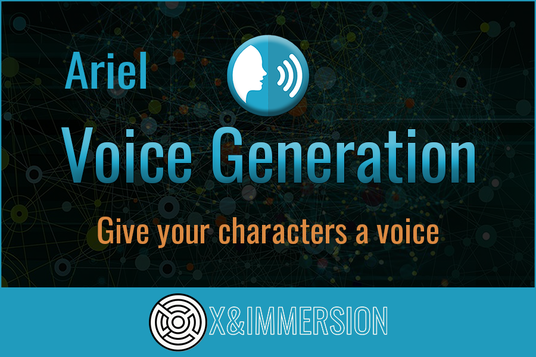

---
include:
  - ./Documentation/Setup.md
    - Assets/ArielVoiceGeneration/Documentation/Quickstart.md
    - Assets/ArielVoiceGeneration/Documentation/Features.md
    - Assets/ArielVoiceGeneration/Documentation/API.md
    - Assets/ArielVoiceGeneration/Documentation/Others.md
# Ariel Plugin for Unitz - Documentation

---

# Ariel Plugin for Unitz - Documentation

## Table of contents

### [Setup](./Documentation/Setup.md)
    [Prerequisites](./Documentation/Setup.md#prerequisites) 
    [Installation](./Documentation/Setup.md#installation) 

### [Quickstart](./Documentation/Quickstart.md)

[🎬 Editor pre-generation](./Documentation/Quickstart.md#-editor-pre-generation) 
[🎤 Runtime generation](./Documentation/Quickstart.md#-runtime-generation) 

### [Features](./Documentation/Features.md)
[🎚️ Audio effects](./Documentation/Features.md#Audio%20effects) 
[📝 Tags](./Documentation/Features.md#Tags) 

### [API Reference](./Documentation/API.md)
[📚 Ariel Text-To-Speech (Remote)](./Documentation/API.md#ariel-remote-class) 
[📚 Ariel Text-To-Speech (Local)](./Documentation/API.md#ariel-local-class) 
[📚 Ariel Glossary](./Documentation/API.md#glossary-class) 
[💾 Ariel Save Wav](./Documentation/API.md#save-bytes-to-file) 
[🔧 Ariel Common Types](./Documentation/API.md#ariel-tts-class-editor-version) 

### [Others](Documentation/Others.md)

 

If you have any question, do not hesitate to contact us through our [Discord server](https://discord.gg/qDMwNCDE8X) or by mail at [contact@xandimmersion.com](mailto:contact@xandimmersion.com)

## Speakers

> The available speakers depend on the API Key provided to you. The following list is the default list of speakers available for the plugin. If you have a specific request, please contact us.

> We are providing customized speaker training for your project. If you are interested in a specific speaker or language, please get in touch with us.

Local speakers are available for offline use. Online speakers require an internet connection.

| **Name**      | Type      | Gender            | Language(s) |
| ------------- | --------- | ----------------- | ------------ |
| **Bryan**    | *Online*   | male   | English, Spanish, French, German, Italian, Portuguese, Polish, Turkish, Russian, Dutch, Czech, classic Arabic, Chinese, Japanese, Korean |
| **Bryan**    | *Local*   | male   | English |
| **Abrogail**    | *Online*   | female            | English, Spanish, French, German, Italian, Portuguese, Polish, Turkish, Russian, Dutch, Czech, classic Arabic, Chinese, Japanese, Korean |
| **Abrogail**    | *Local*   | female            | English|

